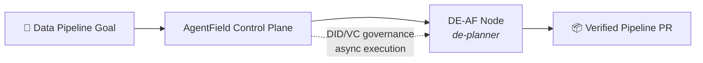
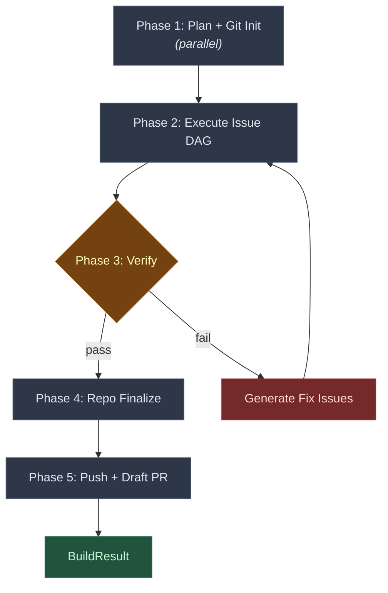
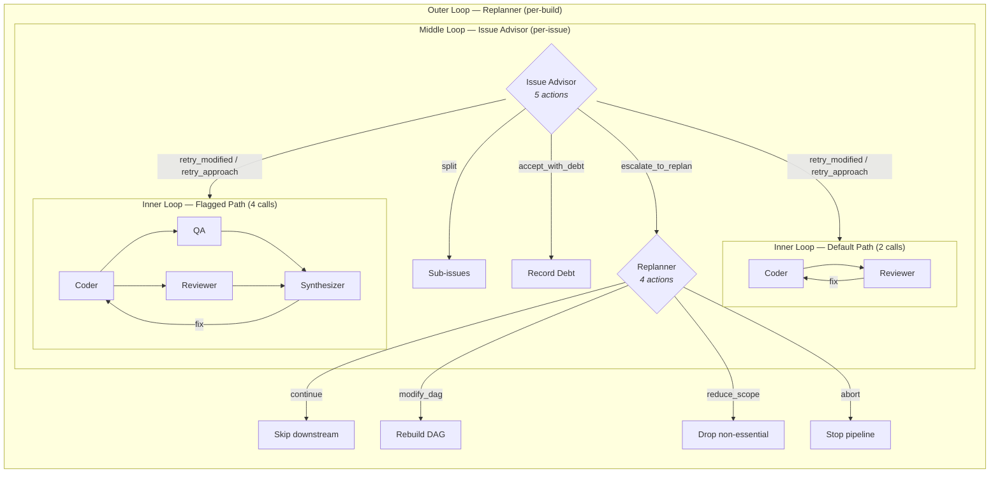
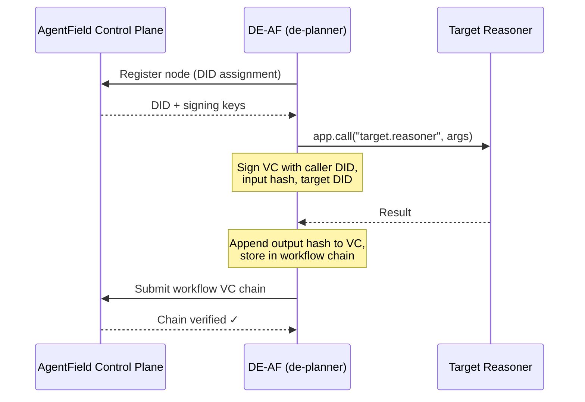

# DE-AF Architecture

DE-AF is an [AgentField](https://github.com/Agent-Field/agentfield) node that transforms a natural-language data engineering goal into a verified, merged data pipeline codebase with a draft GitHub PR. It registers as `de-planner` on the AgentField control plane and exposes reasoner endpoints callable via async execution APIs. A typical build orchestrates 400–500+ agent invocations across 22 specialized roles; large builds scale into the thousands. Every agent action is cryptographically attested via AgentField's [DID/VC governance chain](#agentfield-governance-did--verifiable-credentials).



**Table of Contents**

- [Build Pipeline](#build-pipeline)
- [Planning → Issue DAG](#planning--issue-dag)
- [Execution Engine & Data Engineering Patterns](#execution-engine--data-engineering-patterns)
- [AgentField Governance: DID & Verifiable Credentials](#agentfield-governance-did--verifiable-credentials)
- [Agent Catalog](#agent-catalog)

---

## Build Pipeline

The top-level `build()` reasoner is the single entry point. It drives six phases in sequence, with an embedded verify-fix loop that makes the pipeline self-correcting. The entire pipeline is idempotent — checkpoints after every phase boundary allow `resume_build()` to restart from the exact failure point.



**Phase 1 — Plan + Git Init.** Two concurrent operations via `asyncio.gather`: the planning chain produces a PRD, architecture, and Issue DAG (see [next section](#planning--issue-dag)), while `run_git_init` sets up the integration branch and records the initial commit SHA. Git init is non-fatal — its failure doesn't block the build.

**Phase 2 — Execute Issue DAG.** The DAG executor runs all issues through the hierarchical escalation loops (see [Hierarchical Escalation Control for Data Pipelines](#pattern-hierarchical-escalation-control-for-data-pipelines)), parallelizing within dependency levels. This is where the bulk of agent invocations happen. The hierarchical escalation system enables data-specific failure recovery strategies at three levels: coding loop retries for syntax/test failures, issue advisor interventions for schema conflicts, and replanner adjustments for systemic pipeline issues. Returns a `DAGState` with per-issue outcomes, accumulated debt, and merge history.

**Phase 3 — Verify-Fix Loop.** The Verifier agent checks every acceptance criterion from the PRD against the actual codebase. If any criterion fails, the Fix Generator produces targeted fix issues, which feed back into the executor. This loop runs up to `max_verify_fix_cycles + 1` times. On pass, the build advances.

**Phase 4 — Repo Finalize.** Cleanup: remove build artifacts from the repo, update `.gitignore`, ensure the working tree is presentable. Non-blocking — failure here doesn't affect the build result.

**Phase 5 — Push + Draft PR.** Pushes the integration branch and creates a draft PR via `gh`. The PR body includes the PRD, architecture summary, and any accumulated technical debt — reviewers see exactly what was built, what was deferred, and why.

**Result.** `BuildResult` captures: plan output, full `DAGState`, verification result, success flag, summary, and PR URL.

---

## Planning → Issue DAG

The planning chain is a five-agent pipeline that progressively refines a vague data engineering goal into a dependency-sorted graph of concrete work items. The key insight is that what emerges is an **Issue DAG** — a dependency graph of *work items*, not agents. Agents are execution machinery; the DAG is the plan.

**The Chain:**

1. **Product Manager** — reads the repo, interprets the data engineering goal, produces a PRD with validated requirements, acceptance criteria, data sources, transformations, schema specifications, data quality expectations, SLAs, must-haves, nice-to-haves, and out-of-scope items.

2. **Architect** — reads the PRD and codebase, produces a data platform design: data flow diagrams (extraction → transformation → loading), schema definitions (DDL, types, constraints, partitioning), data quality checkpoints, infrastructure components (warehouses, orchestrators, storage layers), integration points, and architectural decisions with rationale.

3. **Tech Lead** — reviews the architecture against the PRD in a bounded loop (up to `max_review_iterations + 1` rounds). If not approved, the Architect revises. If the loop exhausts, the last revision is auto-approved — the system never blocks on infinite review cycles.

4. **Sprint Planner** — decomposes the approved architecture into `PlannedIssue` items. Each issue has a name, acceptance criteria mapped from the PRD, dependency edges (`depends_on`), file manifests (`files_to_create`, `files_to_modify`), and — critically — an `IssueGuidance` block plus a `data_validation_strategy` field:

   ```
   PlannedIssue:
     data_validation_strategy: str   # "dbt tests" | "Great Expectations" | "SQL assertions"

   IssueGuidance:
     needs_new_tests: bool       # should the coder write data quality tests?
     estimated_scope: str        # "trivial" | "small" | "medium" | "large"
     touches_interfaces: bool    # cross-pipeline work?
     needs_deeper_qa: bool       # route to flagged (4-call) path?
     testing_guidance: str       # proportional test instructions
     review_focus: str           # what the reviewer should focus on
     risk_rationale: str         # why this needs (or doesn't need) deep QA
   ```

   The `needs_deeper_qa` flag is the routing decision that splits execution into [two paths](#pattern-risk-proportional-resource-allocation) — it's the sprint planner's judgment call on risk. The `data_validation_strategy` guides the coder on which data quality framework to use.

5. **Issue Writers** — fan out in parallel across all issues, writing self-contained `issue-*.md` specs with full context so each coder agent can work independently.

**From Issues to Levels:**

After planning, `_compute_levels()` runs **Kahn's algorithm** to topologically sort issues into parallel execution levels. Issues with no unmet dependencies land in level 0; issues depending only on level-0 work land in level 1; and so on. The algorithm detects cycles and raises immediately — a cyclic plan is a hard failure.

`_validate_file_conflicts()` then scans each level for issues that touch the same files. These aren't blocking — parallel issues can still run — but the conflicts are passed to the Merger agent so it can make informed resolution decisions when branches converge.

The output is a `PlanResult`: PRD, architecture, review, sorted issues with sequence numbers, execution levels, file conflicts, and a rationale for the decomposition.

---

## Execution Engine & Data Engineering Patterns

This is the heart of DE-AF. The execution engine isn't a simple "run each issue" loop — it's a layered system of control loops, adaptive strategies, and resilience patterns that handle the reality of autonomous data pipeline generation: schemas drift, data quality tests fail, infrastructure provisioning conflicts arise, and the plan itself may need to change.

The patterns below are foundational architectural patterns for any production [AI backend](https://www.agentfield.ai/blog/posts/ai-backend) that aims for **guided autonomy** rather than the "autonomous agent fantasy" of unrestricted single-orchestrator systems. Each pattern addresses a fundamental challenge in multi-agent autonomous systems. DE-AF's contribution is adapting these patterns to data engineering workflows with specialized validation gates and schema-aware coordination.

### Pattern: Hierarchical Escalation Control for Data Pipelines

**The general principle.** Any autonomous system that goes beyond single-shot inference needs a theory of failure recovery. The question isn't *if* an agent will fail — it's *what happens next*. Without structured escalation, systems either retry forever (wasting budget) or abort immediately (wasting progress). The pattern is concentric control loops with increasing blast radius and decreasing frequency, mirroring how human data engineering teams escalate: a developer retries locally, a lead architect changes the approach, a product manager rescopes the project.

**Why this is critical for data engineering.** Data pipeline failures have unique characteristics: schema drift from upstream sources, data quality issues that only appear with real data, infrastructure state conflicts in Terraform, and backward compatibility requirements for schema evolution. Flat retry logic can't handle these — an agent retrying the same DDL statement won't magically fix a schema incompatibility. Hierarchical escalation gives the system *multiple levels of recovery* with data-specific intervention strategies.

**How DE-AF implements it.** The execution engine operates as three nested control loops:



**Inner Loop** runs up to `max_coding_iterations` (default: 5) per issue. On the default path, the coder writes SQL/dbt/Airflow/Terraform code and runs tests, then the reviewer approves, requests fixes, or blocks. On the flagged path, QA and the reviewer run **in parallel** after the coder, and a synthesizer merges their feedback into a single fix/approve/block decision. The synthesizer also detects stuck loops — if the coder is cycling without progress, it breaks the loop early.

**Middle Loop** — the Issue Advisor — activates when the inner loop exhausts without approval. It has five actions, each a different recovery strategy:

| Action | What happens in data engineering context |
|---|---|
| `RETRY_MODIFIED` | Relax acceptance criteria, retry the coding loop. Dropped criteria become [technical debt](#pattern-graceful-degradation-with-explicit-incompleteness). Example: defer complex data quality rule to next sprint. |
| `RETRY_APPROACH` | Keep the same ACs but inject a different strategy (e.g., "use incremental dbt models instead of full refresh", "simplify schema to avoid complex joins"). |
| `SPLIT` | Break the issue into smaller sub-issues. Example: split "build customer 360 pipeline" into "extract raw data", "transform staging", "build dimension table". |
| `ACCEPT_WITH_DEBT` | The work is close enough. Record each gap as a typed, severity-rated debt item and mark the issue complete. Example: schema is correct but missing optimal indexes. |
| `ESCALATE_TO_REPLAN` | This issue can't be fixed locally — flag it for the outer loop. Example: discovered upstream source schema changed, entire extraction strategy needs redesign. |

The advisor runs up to `max_advisor_invocations` (default: 2) per issue. On the final invocation, the prompt explicitly warns that this is the last chance — biasing toward `ACCEPT_WITH_DEBT` or `ESCALATE_TO_REPLAN` rather than another retry.

**Outer Loop** — the Replanner — fires when one or more issues in a level produce `FAILED_UNRECOVERABLE` or `FAILED_ESCALATED` outcomes. It sees the full `DAGState` (completed issues, failures, debt, replan history) and chooses from four actions:

| Action | Data engineering scenarios |
|---|---|
| `CONTINUE` | Proceed as-is. Skip downstream dependents of failed issues. Example: warehouse provisioning failed but local dbt development can continue. |
| `MODIFY_DAG` | Restructure the remaining Issue DAG — add new issues, remove others, modify dependencies. Example: add schema migration phase issues after discovering backward compatibility violation. |
| `REDUCE_SCOPE` | Skip non-essential issues to unblock the build. Example: defer data lineage documentation to ship core pipeline. |
| `ABORT` | Cannot recover. Stop the pipeline. Example: target warehouse credentials invalid, no way to proceed. |

**Crash fallback**: if the replanner agent itself fails (LLM timeout, malformed output), the system defaults to `CONTINUE`, not `ABORT`. The build should degrade gracefully, not halt on orchestration errors.

**Key insight**: The hierarchical escalation pattern is what enables DE-AF to handle data-specific failures gracefully. Schema drift detected by the Data Quality Validator triggers a coding loop retry with corrected schema. Persistent data quality test failures escalate to the Issue Advisor, which may relax non-critical test coverage requirements. Systemic infrastructure provisioning failures escalate to the Replanner, which can restructure the DAG to defer infra-dependent issues. This multi-tier recovery strategy is essential for autonomous data engineering — no single failure mode blocks the entire pipeline.

---

### Data Validation Gates

DE-AF injects data quality validation at multiple pipeline stages to ensure correctness, schema adherence, and production-readiness. These gates are layered defenses — each catches different classes of data engineering errors.

#### Stage 1: Post-Coder Validation (Data Quality Validator)

After coder produces SQL/dbt/Airflow/Terraform code, the **Data Quality Validator** agent verifies:

- **Critical column coverage**: Primary keys, foreign keys, amounts, dates have tests
- **Schema correctness**: DDL matches architecture spec (column names, types, constraints)
- **PII detection**: Sensitive columns (email, SSN, phone) have validation tests
- **Framework compliance**: `data_validation_strategy` from issue was followed (dbt tests vs Great Expectations vs SQL assertions)
- **Data profiling setup**: New tables have row count, null%, distinct count checks

**Decision point**: If validator fails, return to coder with specific test coverage gaps. Example: "Missing not_null test on customer_id primary key, missing foreign key relationship test from orders to customers."

**Validation output**:
```json
{
  "validation_passed": false,
  "missing_tests": ["orders.customer_id: missing relationships test to dim_customers"],
  "schema_mismatches": ["orders.order_date type is VARCHAR, expected DATE"],
  "pii_gaps": ["customers.email: missing email format validation"],
  "summary": "Schema type mismatch on order_date, missing 2 critical tests"
}
```

This stage is **always-on** for any issue with `needs_new_tests: true` in guidance.

#### Stage 2: QA Deep Validation (Flagged Path Only)

For complex issues (multi-table joins, schema migrations, PII handling), the **QA agent** augments with:

- **Business rule validation**: Calculated fields, status transitions, derived columns have correctness tests
- **Idempotency checks**: Running pipeline twice produces same result (critical for incremental models)
- **Edge case coverage**: Empty tables, NULL values, date boundaries, zero amounts
- **Integration validation**: End-to-end with fixture data (CSV → transform → output validation)
- **Performance validation**: Query execution plans checked for missing indexes, full table scans

**Decision point**: If QA fails, synthesizer decides fix/approve/block. QA failures on idempotency or data correctness are BLOCKING; performance issues are flagged as debt.

**QA test examples**:
```sql
-- Idempotency test for incremental dbt model
-- Run 1: INSERT 100 rows → expect 100 output rows
-- Run 2: Re-run same input → expect still 100 output rows (no duplicates)

-- Business rule test
-- All orders must have order_date <= ship_date
SELECT COUNT(*) FROM orders WHERE order_date > ship_date
-- Expect: 0
```

This stage runs only when `needs_deeper_qa: true` (Sprint Planner's risk assessment).

#### Stage 3: Schema Review (Schema Changes Only)

When DDL or dbt `schema.yml` changes detected, the **Schema Reviewer** validates:

- **Backward compatibility**: No column drops, no type narrowing (VARCHAR(100)→VARCHAR(50)), additive-only changes
- **Migration safety**: Non-blocking DDL for large tables, validation before constraint enforcement
- **Index coverage**: Primary keys defined, foreign keys indexed for join performance
- **Partitioning strategy**: High-cardinality partition keys (date/timestamp), reasonable partition sizes (10GB-100GB)
- **Data type precision**: DECIMAL for currency (not FLOAT), TIMESTAMP WITH TIME ZONE for UTC

**Decision point**: Blocking schema issues (column drops, type narrowing, constraint enforcement without validation) return to coder; non-blocking improvements (missing indexes, suboptimal partition keys) flagged as tech debt.

**Schema review blocking issues**:
- ❌ `ALTER TABLE customers DROP COLUMN email` — breaks existing queries
- ❌ `ALTER TABLE orders ALTER COLUMN amount TYPE FLOAT` — FLOAT for currency is data loss risk
- ❌ `ALTER TABLE orders ALTER COLUMN customer_id SET NOT NULL` — constraint enforcement without validation

**Schema review non-blocking improvements**:
- ⚠️ Missing index on `orders.customer_id` (foreign key should be indexed)
- ⚠️ Partition key `country_code` is low-cardinality (will cause partition skew)
- ⚠️ `VARCHAR(MAX)` for `product_name` (should define reasonable limit like VARCHAR(200))

This stage runs when file changes include `.sql` DDL, `schema.yml`, or Terraform table definitions.

#### Stage 4: Integration Testing (Post-Merge)

After parallel issues merge, the **Integration Tester** runs:

- **Full pipeline execution**: Run dbt models, Airflow DAGs, Spark jobs with fixture data
- **Data quality test suite**: Execute all dbt tests, Great Expectations suites, SQL assertions
- **Schema validation**: Output tables exist, match expected DDL (column names, types, constraints)
- **Row count reconciliation**: Input rows → output rows accounting (no silent data loss)
- **Cross-pipeline validation**: Downstream pipelines can read upstream outputs (schema compatibility)

**Decision point**: Integration failure triggers replanner if systemic (e.g., entire warehouse provisioning broken); otherwise retry with fixes.

**Integration test validation**:
```bash
# Run full dbt project
dbt build --target dev --select +dim_customers

# Verify output schema
SELECT column_name, data_type, is_nullable
FROM information_schema.columns
WHERE table_name = 'dim_customers'
ORDER BY ordinal_position

# Row count reconciliation
# Input: customers.csv (1000 rows)
# Staging: stg_customers (1000 rows expected)
# Dimension: dim_customers (1000 rows expected, no duplicates)
```

This stage runs after every level merge if the merger flags cross-boundary changes.

---

### Schema Migration Coordination

Schema evolution requires multi-phase coordination to maintain backward compatibility and avoid breaking downstream pipelines. DE-AF uses the **Schema Migrator** agent to decompose risky schema changes into safe, reversible phases.

**Migration Principles**:

1. **Additive first**: Always add new columns as nullable, then backfill, then enforce constraints
2. **Never break readers**: Downstream pipelines must continue working during migration
3. **Atomic phases**: Each phase is a complete, testable unit with validation + rollback
4. **Dependency-aware**: Update dependent pipelines only after schema is stable

**Common Migration Patterns**:

#### Pattern 1: Add NOT NULL Column

Problem: Adding a NOT NULL column directly fails if table has existing rows.

Solution:
- **Phase 1**: `ALTER TABLE customers ADD COLUMN tier VARCHAR(20) NULL`
- **Phase 2**: Backfill: `UPDATE customers SET tier = 'standard' WHERE tier IS NULL`
- **Phase 3**: Validate: `SELECT COUNT(*) FROM customers WHERE tier IS NULL` → expect 0
- **Phase 4**: Enforce: `ALTER TABLE customers ALTER COLUMN tier SET NOT NULL`

Each phase has a validation query and rollback SQL.

#### Pattern 2: Change Column Type (Widening)

Problem: Changing `order_id INT` to `order_id BIGINT` requires careful migration.

Solution:
- **Phase 1**: `ALTER TABLE orders ADD COLUMN order_id_v2 BIGINT NULL`
- **Phase 2**: Backfill: `UPDATE orders SET order_id_v2 = order_id WHERE order_id_v2 IS NULL`
- **Phase 3**: Validate: `SELECT COUNT(*) FROM orders WHERE order_id != order_id_v2` → expect 0
- **Phase 4**: Update downstream pipelines to reference `order_id_v2`
- **Phase 5**: Drop old column: `ALTER TABLE orders DROP COLUMN order_id`
- **Phase 6**: Rename: `ALTER TABLE orders RENAME COLUMN order_id_v2 TO order_id`

#### Pattern 3: Schema Evolution with Dependent Pipelines

Problem: `dim_customers` table schema changing, but 3 downstream dbt models reference it.

Solution:
- **Phase 1**: Schema Reviewer identifies dependent pipelines via dbt `ref()` analysis
- **Phase 2**: Schema Migrator plans phased rollout: add column (nullable) → backfill → update downstream models → enforce constraint
- **Phase 3**: Sprint Planner creates sub-issues: "Migrate dim_customers schema", "Update customer_360 model", "Update customer_churn model", "Update customer_ltv model"
- **Phase 4**: Issue dependencies ensure downstream updates happen AFTER schema is backfilled but BEFORE constraint enforcement

**Schema Migrator Output Schema**:

```python
class SchemaMigrationPlan(BaseModel):
    table_name: str
    change_description: str
    phases: list[SchemaMigrationPhase]  # Each phase: DDL, validation query, rollback SQL
    affected_pipelines: list[str]       # dbt models or Airflow DAGs that depend on this table
    rollback_plan: str
    testing_strategy: str
```

The Schema Migrator generates this plan, which the Sprint Planner uses to create correctly-sequenced issues.

---

### Infrastructure Provisioning Sequence

Infrastructure-as-code (Terraform/Pulumi) for data platforms has strict ordering requirements to avoid state conflicts and resource dependency failures. DE-AF enforces a serialization strategy for infrastructure issues.

**Provisioning Order**:

1. **Warehouse/Cluster**: Snowflake warehouse, Databricks cluster, BigQuery dataset
2. **Database/Schema**: Logical database, schema namespace
3. **Tables/Views**: DDL execution (depends on schema existing)
4. **Access Control**: Role grants, user permissions (depends on resources existing)
5. **Orchestrator**: Airflow, Prefect, dbt Cloud jobs (depends on warehouse + tables)

**Implementation**:

The Sprint Planner marks all infrastructure issues with `requires_serial_execution: true` in `IssueGuidance`. The DAG executor sequences them even if dependency graph allows parallelism.

**Why serialization is required**:

- **Terraform state conflicts**: Two parallel `terraform apply` runs on the same state file cause corruption
- **Resource dependencies**: Can't create table before database exists
- **Provider rate limits**: Cloud provider APIs throttle concurrent resource creation
- **Idempotency verification**: Need to verify each resource exists before next phase

**Example Issue DAG**:

```
Level 0:
  - issue-01-provision-snowflake-warehouse (serial: true)

Level 1:
  - issue-02-create-raw-database (serial: true, depends_on: issue-01)
  - issue-03-create-analytics-database (serial: true, depends_on: issue-01)

Level 2:
  - issue-04-create-staging-schema (serial: true, depends_on: issue-02)
  - issue-05-create-marts-schema (serial: true, depends_on: issue-03)

Level 3:
  - issue-06-create-customers-table (serial: false, depends_on: issue-04)
  - issue-07-create-orders-table (serial: false, depends_on: issue-04)
  - issue-08-create-customer-360-view (serial: false, depends_on: issue-05)
```

Infrastructure issues run serially within their level; table creation can parallelize once schema exists.

---

### Pattern: Structured Concurrency with Barrier Synchronization

**The general principle.** Multi-agent systems need parallelism — sequential execution of independent work wastes time and money. But naive parallelism (fire-and-forget) creates chaos: agents interfere with each other, partial failures cascade, and there's no clean state to recover from. The answer is *structured concurrency* — parallel execution within well-defined boundaries, with barrier synchronization points that enforce invariants before the next phase begins.

**Why this is critical for data pipelines.** Data engineering workflows have strict dependency requirements: can't load data before schema exists, can't transform before extraction completes, can't test before pipeline runs. Structured concurrency ensures these ordering constraints are respected while maximizing parallelism where dependencies allow.

**How DE-AF implements it.** Issues within a dependency level execute concurrently via `asyncio.gather`. A level of 5 issues can spawn 10–20 agent invocations in parallel (each issue runs its own inner loop). Between levels, a structured gate sequence runs:

1. **Worktree setup** — create isolated git worktrees for the next level's issues.
2. **Parallel execution** — all issues in the level run concurrently through the inner/middle loops.
3. **Result classification** — sort outcomes into completed, completed-with-debt, failed-needs-split, failed-escalated, and failed-unrecoverable.
4. **Merge gate** — the Merger agent integrates completed branches into the integration branch, resolving conflicts with AI assistance.
5. **Integration test gate** — if the merger flags cross-boundary changes, the Integration Tester validates end-to-end pipeline execution.
6. **Debt gate** — process `COMPLETED_WITH_DEBT` results: record debt, propagate `debt_notes` to downstream issues.
7. **Split gate** — process `FAILED_NEEDS_SPLIT` results: generate sub-issues, inject them into remaining levels.
8. **Replan gate** — if unrecoverable/escalated failures exist, invoke the replanner.
9. **Checkpoint** — save full `DAGState` to disk.
10. **Advance** — move to the next level (or reset to level 0 if the replanner restructured the DAG).

This gate sequence ensures that every level produces a clean, tested, checkpointed state before the next level begins. No level starts on a dirty foundation.

The barrier synchronization pattern works in concert with hierarchical escalation: failures caught at gates trigger appropriate escalation (test failures → coding loop retry, merge conflicts → issue advisor, systemic issues → replanner). This ensures failures are handled at the right level of abstraction.

---

### Pattern: Agent Isolation with Semantic Reconciliation

**The general principle.** When multiple agents operate on the same shared state (a filesystem, a database, a document), they interfere with each other. Write conflicts, stale reads, and race conditions are inevitable. The pattern is twofold: *isolate* agents so they can't interfere during execution, then *reconcile* their outputs using semantic understanding rather than mechanical merging.

**Why this is critical for data pipelines.** Data pipeline code has complex interdependencies: dbt models reference each other via `ref()`, SQL DDL statements must execute in order, Terraform resources have provider-level dependencies. Parallel agents modifying the same dbt project or Terraform state can create invalid configurations. Isolation prevents interference; semantic reconciliation ensures the merged result is logically coherent.

**How DE-AF implements it.** Each parallel issue gets its own **git worktree** — a separate working directory on a dedicated branch (`issue/{NN}-{slug}`). Coders have full filesystem access without interfering with each other. No lock contention, no merge conflicts during coding.

After level completion, the **Merger agent** integrates completed branches into the integration branch. This isn't a mechanical `git merge` — the Merger reads the PRD, architecture context, and file conflict annotations from the planning phase to make intelligent resolution decisions. When two issues modify the same dbt model or SQL schema, the Merger understands *what each change intended* and produces a merged result that preserves both intents.

**Example semantic merge scenario**:

- Issue A: Add `customer_tier` column to `dim_customers` dbt model
- Issue B: Add `lifetime_value` column to `dim_customers` dbt model
- Both modify `models/marts/dim_customers.sql`

Mechanical merge would conflict. Semantic merge:
1. Merger reads both issue specs
2. Understands both are additive schema changes
3. Combines both column additions in final SELECT
4. Ensures consistent ordering, formatting, and tests for both columns

The merge result includes: which branches succeeded, which failed, conflict resolution strategies used, and whether integration testing is needed. If the merge fails, it retries once before marking branches as unmerged. After merge, worktrees are cleaned up — branches optionally deleted, working directories removed.

---

### Pattern: Graceful Degradation with Explicit Incompleteness

**The general principle.** Autonomous systems that target 100% completion are fragile — a single unresolvable failure blocks the entire pipeline. Production systems need *graceful degradation*: the ability to deliver partial results while being explicit about what's missing and why. The pattern is to make incompleteness a first-class data type, not a silent omission. Gaps are tracked, typed, severity-rated, and propagated to every downstream consumer.

**Why this is critical for data engineering.** Data pipelines often have "must-have" vs "nice-to-have" components: core transformations vs optional aggregations, critical data quality tests vs comprehensive profiling, essential indexes vs performance optimizations. A system that blocks the entire pipeline because an optional aggregation failed is overly rigid. Graceful degradation allows shipping the core pipeline while explicitly documenting deferred work.

**How DE-AF implements it.** When the Issue Advisor relaxes acceptance criteria via `RETRY_MODIFIED`, or accepts incomplete work via `ACCEPT_WITH_DEBT`, the gaps don't vanish — they become **typed, severity-rated debt items** tracked in `DAGState.accumulated_debt`:

```json
{
  "type": "dropped_acceptance_criterion",
  "criterion": "Add bitmap indexes on status columns for query performance",
  "issue_name": "create-orders-table",
  "severity": "low",
  "justification": "Table created with primary/foreign key indexes; bitmap indexes deferred as performance optimization"
}
```

**Debt categories for data engineering**:

| Type | Example | Severity |
|---|---|---|
| `dropped_acceptance_criterion` | "Add row-level security policies" deferred | Medium |
| `missing_functionality` | Optional data lineage tracking not implemented | Low |
| `schema_optimization` | Missing indexes on foreign keys | Medium |
| `data_quality_gap` | Comprehensive data profiling deferred (basic tests exist) | Low |
| `infrastructure_config` | Auto-scaling for warehouse not configured (fixed size works) | Low |

Debt propagates downstream. When an issue completes with debt, all issues that depend on it receive `debt_notes` — structured annotations explaining what upstream *didn't* deliver. Coders for downstream issues see these notes at the start of every iteration, so they can work around gaps rather than building on assumptions that don't hold.

**Example debt propagation**:

- Issue A: Create `dim_customers` table — completes with debt "Missing partition pruning optimization"
- Issue B: Build `customer_360` dbt model (depends on Issue A) — receives debt note: "Upstream table dim_customers not partitioned; full table scans required. Consider adding partition filters if query performance degrades."

Debt accumulates across the entire build and surfaces in the final PR body. Nothing is silently dropped — the PR reviewer sees a complete accounting of every scope reduction, every relaxed criterion, and every gap.

---

### Pattern: Runtime Plan Mutation

**The general principle.** Static plans break on contact with reality. In any autonomous system operating over extended timeframes (minutes to hours), the initial plan will become partially invalid as execution reveals unforeseen constraints, failures, or opportunities. The pattern is to treat the execution plan as a *mutable runtime artifact* — not a static script — that the system can restructure while preserving invariants (no cycles, no orphaned dependencies, no lost state).

**Why this is critical for data engineering.** Data engineering plans are especially fragile to runtime discoveries: source schema changes, warehouse resource limits, data quality issues requiring additional validation stages, infrastructure provisioning failures. A static plan can't adapt when the Sprint Planner discovers at level 3 that the source API changed and extraction logic needs complete redesign.

**How DE-AF implements it.** When the replanner fires with `MODIFY_DAG`, it doesn't just skip failed issues — it can **restructure the entire remaining Issue DAG**. `apply_replan()` in `dag_utils.py` executes this in five steps:

1. **Filter** — separate completed/failed issues from the remaining working set.
2. **Remove** — delete issues the replanner marked for removal.
3. **Skip** — mark issues as skipped (preserved in state but not executed).
4. **Update** — merge modifications into existing issues (changed ACs, new dependencies, different approach).
5. **Add** — inject entirely new issues with auto-assigned sequence numbers.

After mutations, `recompute_levels()` runs Kahn's algorithm on the remaining issues, treating completed issues as already-satisfied dependencies. The DAG state resets to `current_level = 0` and execution restarts from the beginning of the new level structure.

**Data engineering replan scenarios**:

| Trigger | Replanner Action | New Issues |
|---|---|---|
| Source schema changed | `MODIFY_DAG` | Add "update extraction schema mapping", "backfill historical data with new schema" |
| Warehouse quota exceeded | `REDUCE_SCOPE` | Skip optional aggregation tables, keep core dimensions |
| Data quality failures | `MODIFY_DAG` | Add "implement data validation layer", "add sanitization logic" |
| Infrastructure timeout | `CONTINUE` | Skip dependent infrastructure issues, flag for manual provisioning |

Previous replan decisions are stored in `DAGState.replan_history` and fed back to the replanner on subsequent invocations. This prevents the system from repeating failed strategies — each replan attempt has full context of what was already tried and why it didn't work.

---

### Pattern: Durable Execution & Checkpoint Recovery

**The general principle.** Long-running autonomous processes — builds, research pipelines, multi-step workflows — will be interrupted. Hardware fails, LLM providers have outages, rate limits hit, timeouts fire. Any system that can't survive interruption is a system you can't rely on. The pattern is *durable execution*: serialize the complete execution state at every significant boundary so the system can resume from the exact failure point, not from scratch.

**Why this is critical for data engineering.** Data pipeline builds involve expensive operations: Terraform provisioning (minutes), dbt model compilation (minutes), integration tests with real data (minutes to hours). A build that fails after 20 minutes of Terraform provisioning must not re-provision from scratch on resume — infrastructure costs and time waste are unacceptable.

**How DE-AF implements it.** Full `DAGState` is serialized to `.artifacts/execution/checkpoint.json` at every significant boundary:

- After initial DAG setup
- Before and after each level execution
- After split gate (sub-issues injected)
- After replan applied (DAG restructured)
- On build completion

`DAGState` captures everything needed to resume: repo paths, artifact paths, plan summaries, all issues with current state, execution levels, completed/failed/skipped/in-flight issue lists, current level index, replan count and history, git branch tracking (integration branch, original branch, initial commit, worktree directory), merge results, integration test results, accumulated debt, and adaptation history.

`resume_build()` loads the checkpoint, reconstructs the plan result from saved state, and calls `execute()` with `resume=True`. The executor loads the checkpoint and skips already-completed levels, continuing from the exact failure point. This enables reliability across crashes, timeouts, and interruptions — a build that fails at level 3 of 5 doesn't restart from scratch.

---

### Pattern: Risk-Proportional Resource Allocation

**The general principle.** Not all tasks in an autonomous workflow carry the same risk or complexity. Applying uniform scrutiny everywhere is wasteful — heavyweight quality assurance on trivial tasks burns budget, while lightweight checks on critical tasks miss defects. The pattern is to classify tasks by risk at planning time and allocate quality assurance resources proportionally: lean paths for safe work, thorough paths for risky work.

**Why this is critical for data engineering.** Data pipeline tasks span a massive risk spectrum: a one-line config change to a dbt project vs. a multi-table schema migration affecting downstream pipelines. The schema migration needs deep validation (QA tests, schema review, integration testing); the config change needs a quick review. Treating them the same wastes budget on trivial work or under-validates risky work.

**How DE-AF implements it.** The Sprint Planner's `IssueGuidance.needs_deeper_qa` flag routes each issue to one of two execution paths:

**Default path (2 LLM calls):** Coder → Reviewer. For straightforward issues — well-scoped, low risk, familiar patterns. Examples: add new dbt source definition, update Airflow schedule, add simple SQL transformation. The reviewer approves, requests fixes, or blocks (reserved for data loss/security/compatibility concerns).

**Flagged path (4 LLM calls):** Coder → QA + Reviewer (parallel) → Synthesizer. For complex or risky issues — touching schemas, large scope, data quality critical, PII handling. Examples: multi-table join with complex business logic, schema migration, data masking implementation, cross-warehouse replication. QA writes and runs data quality tests independently. The reviewer evaluates code quality, schema safety, SQL optimization. The synthesizer merges both signals into a single decision, detecting contradictions and stuck loops.

**Risk assessment criteria for data engineering**:

| Issue Type | Risk Level | Path | Rationale |
|---|---|---|---|
| Add dbt source YAML | Low | Default | Config change, no business logic |
| Simple SQL transformation (SELECT, WHERE) | Low | Default | Single table, no joins, straightforward logic |
| Multi-table JOIN with aggregations | Medium | Flagged | Business logic complexity, data correctness critical |
| Schema change (add column) | Medium | Flagged | Requires schema review, backward compatibility check |
| Schema migration (change type) | High | Flagged | Multi-phase coordination, downstream impact |
| PII masking/encryption | High | Flagged | Security critical, compliance requirement |
| Infrastructure provisioning | Medium | Flagged | State conflicts, cost implications |

The Sprint Planner's `risk_rationale` field documents *why* each routing decision was made — every allocation choice is auditable.

---

### Pattern: Cross-Agent Knowledge Propagation

**The general principle.** In multi-agent systems, each agent starts with a blank context — no knowledge of what sibling or predecessor agents discovered. This means every agent repeats the same mistakes, re-discovers the same conventions, and ignores the same pitfalls. The pattern is *cross-agent knowledge propagation*: a shared memory layer where agents write structured discoveries and downstream agents read them, so lessons learned early propagate through the entire workflow.

**Why this is critical for data engineering.** Data engineering codebases have project-specific conventions that aren't in documentation: "we use snake_case for table names", "all transformations must be idempotent", "PII columns must have `_masked` suffix", "partition by `event_date` not `created_at`". The first agent to discover these conventions shouldn't be the only one that knows — propagate to all downstream agents.

**How DE-AF implements it.** When `enable_learning=true`, DE-AF maintains a shared memory store across all issues in a build:

| Memory Key | Written When | Read By | Content |
|---|---|---|---|
| `codebase_conventions` | First successful coder | All subsequent coders | Discovered conventions: table naming (snake_case), partition strategies, dbt model organization, SQL formatting |
| `failure_patterns` | After any failure | All subsequent coders | Last 10 failure patterns: schema drift errors, data type mismatches, foreign key violations, Terraform state conflicts |
| `bug_patterns` | After any failure | All subsequent coders | Last 20 common bug types: missing NULL checks, timezone conversion errors, duplicate row generation |
| `interfaces/{issue_name}` | On issue completion | Dependent issues | Exported schemas: table DDL, dbt model signatures, API endpoints, file formats |
| `build_health` | Continuously | Orchestration agents | Aggregate status: passing/failing pipelines, test counts, debt items, schema coverage |

**Example memory propagation**:

Issue 1 (create `stg_customers` dbt model) discovers:
- Project uses `source('raw', 'customers')` not hardcoded table names
- All staging models materialized as `view`
- Column naming: `customer_id` not `customerId`

Memory written:
```json
{
  "codebase_conventions": {
    "dbt_sources": "Always use source() function, never hardcode table names",
    "staging_materialization": "view",
    "column_naming": "snake_case"
  }
}
```

Issue 5 (create `stg_orders` dbt model) reads memory and automatically applies same conventions without re-discovery.

This is not a vector database or retrieval system — it's a simple key-value store with structured schemas, updated synchronously at known lifecycle points. The simplicity is intentional: memory is only useful if it's reliable, and the schemas ensure that what's written is always parseable by what reads it.

---

## AgentField Governance: DID & Verifiable Credentials

DE-AF doesn't operate in a vacuum — it runs as a node in the [AgentField](https://github.com/Agent-Field/agentfield) control plane, which provides three layers of cryptographic governance over every agent action.

### DID Identity

Every agent node, reasoner, and skill in the AgentField network receives a **Decentralized Identifier (DID)** via hierarchical BIP-44 key derivation. When DE-AF starts, it registers with the control plane:

```python
app = Agent(
    node_id="de-planner",
    version="1.0.0",
    agentfield_server=os.getenv("AGENTFIELD_SERVER", "http://localhost:8080"),
)
```

The control plane assigns a DID, derives signing keys, and makes the node resolvable via the DID resolution API. Every reasoner decorated with `@app.reasoner()` becomes a callable endpoint addressable by its DID.

### Execution Verifiable Credentials

Every reasoner-to-reasoner call generates a cryptographically signed **Verifiable Credential (VC)** capturing:

- Caller and target DIDs
- Input/output content hashes
- Timestamp and execution metadata
- Cryptographic signature from the caller's derived key

This means every agent invocation — every coder run, every review, every advisor decision — has a tamper-evident provenance record. You can verify that a specific output was produced by a specific agent with specific inputs.



### Workflow VC Chain

All execution VCs for a single build are aggregated into a **workflow chain** — an ordered, linked sequence of credentials that captures the complete provenance of the build. For any output in the final PR, you can trace back through the chain to find: which agent produced it, what inputs it received, which agent produced *those* inputs, and so on, all the way back to the original goal.

This is what separates autonomous agent infrastructure from "just calling an LLM in a loop." The [AgentField platform](https://github.com/Agent-Field/agentfield) provides the governance layer that makes agent outputs auditable, attributable, and verifiable — a requirement for any production deployment where you need to explain *how* a result was produced.

---

## Agent Catalog

DE-AF orchestrates 22 specialized agents across four phases. Each agent is a reasoner endpoint with typed input/output schemas and a defined tool set.

### Planning Agents

| Agent | Role | Tools | Output Schema |
|---|---|---|---|
| **Product Manager** | Interprets data engineering goal, produces PRD with data sources, transformations, schema specs, data quality expectations, SLAs | `READ` `GLOB` `GREP` `BASH` | `PRD` |
| **Architect** | Designs data platform from PRD: data flows (extract → transform → load), schema DDL, data quality checkpoints, infrastructure components | `READ` `WRITE` `GLOB` `GREP` `BASH` | `Architecture` |
| **Tech Lead** | Reviews architecture against PRD | `READ` `GLOB` `GREP` | `ReviewResult` |
| **Sprint Planner** | Decomposes into Issue DAG with `data_validation_strategy` guidance | `READ` `GLOB` `GREP` | `SprintPlanOutput` |
| **Issue Writer** | Writes self-contained issue specs (parallel) | `READ` `WRITE` `GLOB` `GREP` | `IssueWriterOutput` |

### Execution Agents

| Agent | Loop | Tools | Output Schema |
|---|---|---|---|
| **Coder** | Inner | `READ` `WRITE` `EDIT` `BASH` `GLOB` `GREP` | `CoderResult` |
| **Data Quality Validator** | Post-coder | `READ` `GLOB` `GREP` `BASH` | `DataQualityValidationResult` |
| **QA** | Inner (flagged) | `READ` `WRITE` `EDIT` `BASH` `GLOB` `GREP` | `QAResult` |
| **Code Reviewer** | Inner | `READ` `GLOB` `GREP` `BASH` | `CodeReviewResult` |
| **Schema Reviewer** | Post-coder (DDL changes) | `READ` `GLOB` `GREP` `BASH` | `SchemaReviewResult` |
| **QA Synthesizer** | Inner (flagged) | *(none — LLM-only)* | `QASynthesisResult` |
| **Retry Advisor** | Pre-advisor | `READ` `GLOB` `GREP` `BASH` | `RetryAdvice` |
| **Issue Advisor** | Middle | `READ` `GLOB` `GREP` `BASH` | `IssueAdvisorDecision` |
| **Replanner** | Outer | `READ` `GLOB` `GREP` `BASH` | `ReplanDecision` |

**New Data Engineering Agents:**

| Agent | Purpose | When Invoked | Key Validations |
|---|---|---|---|
| **Data Quality Validator** | Verify test coverage for critical columns, schema correctness, PII detection | After coder, before reviewer (always-on if `needs_new_tests: true`) | Primary key tests, foreign key relationships, schema matches architecture, PII validation exists |
| **Schema Reviewer** | Validate schema changes for backward compatibility, migration safety, index coverage | After coder, when DDL/schema.yml changes detected | No column drops, no type narrowing, non-blocking DDL for large tables, indexes on foreign keys |
| **Schema Migrator** | Plan multi-phase schema migrations | Invoked by architect/replanner when risky schema changes detected | Additive-first phases, backward compatibility, rollback plans, affected pipeline tracking |

### Git & Merge Agents

| Agent | Trigger | Tools | Output Schema |
|---|---|---|---|
| **Git Init** | Build start | `BASH` | `GitInitResult` |
| **Workspace Setup** | Level gate | `BASH` | `WorkspaceSetupResult` |
| **Merger** | Level gate (post-execution) | `BASH` `READ` `GLOB` `GREP` | `MergeResult` |
| **Integration Tester** | Level gate (post-merge) | `BASH` `READ` `WRITE` `GLOB` `GREP` | `IntegrationTestResult` |
| **Workspace Cleanup** | Level gate (post-merge) | `BASH` | `WorkspaceCleanupResult` |

### Verification & Finalization Agents

| Agent | Phase | Tools | Output Schema |
|---|---|---|---|
| **Verifier** | Post-execution | `READ` `GLOB` `GREP` `BASH` | `VerificationResult` |
| **Fix Generator** | Verify-fix loop | `READ` `GLOB` `GREP` `BASH` | `FixGeneratorOutput` |
| **Repo Finalizer** | Pre-PR | `BASH` `READ` `GLOB` `GREP` | `RepoFinalizeResult` |
| **GitHub PR Creator** | Final | `BASH` | `GitHubPRResult` |

### Model Configuration

Every build now uses a single V2 model contract:

- `runtime`: `claude_code` or `open_code`
- `models`: flat role map (`default` + explicit role keys)

Supported role keys:

- Planning: `pm`, `architect`, `tech_lead`, `sprint_planner`
- Coding: `coder`, `qa`, `code_reviewer`, `qa_synthesizer`
- Orchestration: `replan`, `retry_advisor`, `issue_writer`, `issue_advisor`
- Verification/Git: `verifier`, `git`, `merger`, `integration_tester`
- Data Engineering: `data_quality_validator`, `schema_reviewer`

Resolution order:

`runtime defaults` → `models.default` → `models.<role>`

Runtime defaults:

| Runtime | Base default | Special default |
|---|---|---|
| `claude_code` | `sonnet` | `qa_synthesizer=haiku` |
| `open_code` | `minimax/minimax-m2.5` | none |
